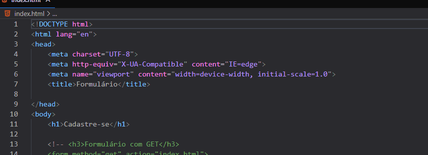
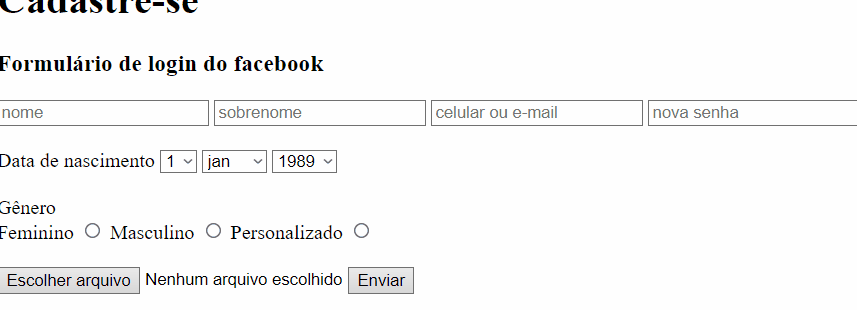

# 1º Formulario de login.

Essa foi a minha primeira tentativa de criar uma tela de formulário similar ao facebook apenas com HTML.  
Obs: A parte de enviar um "file" foi apenas para teste.
 
- HTML (Puro)

  

## Tecnologias Utilizadas

- HTML

## Dados usados

- Facebook login
