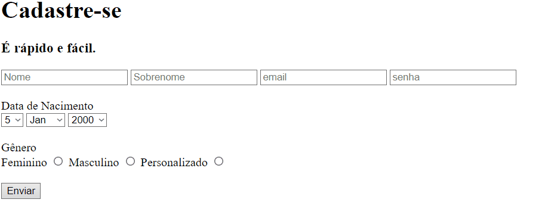

# 1º Formulario de login.

Essa foi a minha primeira tentativa de criar uma tela de formulário similar ao facebook apenas com HTML.  

- Aprendendo sobre select, input e form para envios com get ou post.

 

  

## Tecnologias Utilizadas

- HTML

## Dados usados

- Facebook login
